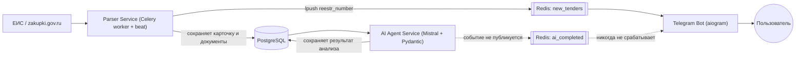

# Tender Bot — техническая документация

Сервис автоматического поиска, ИИ-анализа и мониторинга тендеров по направлениям охраны и пожарной безопасности (44-ФЗ / 223-ФЗ). Микросервисная архитектура на Docker Compose, рассчитана на круглосуточную работу на локальном ПК или любом Linux/Windows-хосте с Docker.

---

## 1. Архитектура

Система состоит из пяти компонентов, развёрнутых как отдельные Docker-контейнеры на одной внутренней сети, обменивающихся данными через PostgreSQL и Redis.

Пунктирные связи на схеме — спроектированы, но не реализованы на момент написания документа (см. раздел 6).

Каждый сервис работает независимо и общается с остальными только через БД или очередь, а не напрямую по коду — это позволяет перезапускать, обновлять и в перспективе масштабировать любой компонент отдельно.

---

## 2. Технологический стек

| Компонент | Язык / рантайм | Ключевые библиотеки | Роль |
|---|---|---|---|
| Parser Service | Python 3.12, Celery (worker + beat) | camoufox, Playwright, SQLAlchemy (async) + asyncpg, redis | Поиск тендеров на ЕИС по ключевым словам и ОКПД2-кодам, извлечение карточки, скачивание документации с версионированием |
| AI Agent Service | Python 3.12 | httpx (клиент Mistral API), python-docx, Pydantic, asyncpg, redis.asyncio | Извлечение текста из документации, структурированный анализ через LLM, валидация результата по строгой схеме |
| Telegram Bot | Python 3.12, aiogram 3 | aiogram, asyncpg, redis.asyncio | Пользовательский интерфейс: карточки тендеров, кнопки статусов, приём push-событий |
| API | — | FastAPI (по исходному каркасу проекта) | Задел под будущий веб-интерфейс; на момент написания документа исходники сервиса не предоставлялись на ревью |
| PostgreSQL 15/16 | — | — | Единое хранилище: тендеры, документы, результаты анализа |
| Redis 7 | — | — | Брокер задач Celery, очередь событий между сервисами, FSM-хранилище состояний бота |

Все сервисы объединены в `docker-compose.yml` и запускаются командой `docker compose up -d --build`.

---

## 3. Поток данных

1. **Celery beat** каждый час ставит задачу `run_eis_parser` в очередь.
2. **Parser** (Celery worker) через `camoufox`/Playwright ищет закупки по заданным ключевым словам и кодам ОКПД2, забирает карточку тендера и скачивает документацию в `data/tenders/{platform}/{reestr_number}/docs/`.
3. Новый тендер сохраняется в PostgreSQL (`tenders`, `tender_documents`); если это не дубликат — реестровый номер публикуется в очередь Redis `new_tenders`.
4. **Telegram Bot** слушает `new_tenders` и отправляет пользователю первичное уведомление с кнопками статусов.
5. **AI Agent** независимо забирает документы тендера, извлекает текст (сейчас — только `.docx`, через собственный экстрактор с определением границ нужного раздела), формирует запрос к Mistral с JSON-схемой на основе Pydantic-модели и валидирует ответ.
6. Результат анализа предполагается сохранять в `tender_analysis` и публиковать событие `ai_completed`, чтобы бот дозаписал карточку итоговым разбором. Этот последний шаг на данный момент не реализован (см. раздел 6).

---

## 4. Особенности реализации

- **Двухуровневый браузерный движок.** `browser_manager.py` сначала пробует `camoufox` (форк Firefox с защитой от антибот-детекта), а при недоступности библиотеки — откатывается на обычный Playwright Firefox с масками автоматизации и кастомным user-agent. Устойчивое решение для разных сред запуска (домашний ПК / VPS).
- **Обход блокировки Telegram Bot API.** Бот ходит в Telegram не напрямую, а через собственный прокси (Cloudflare Worker, настраивается через `TELEGRAM_PROXY_URL`) — актуальное архитектурное решение для инфраструктуры, размещённой там, где прямой доступ к `api.telegram.org` ограничен.
- **Умное извлечение текста из документов.** `smart_extractor.py` ищет в `.docx` маркеры начала/конца содержательного раздела (техническое задание, описание объекта закупки и т.п.) регулярными выражениями, отбрасывает юридическую воду (проект контракта, инструкции по заполнению заявки), и отдельно конвертирует таблицы Word в Markdown — именно в таблицах чаще всего лежат графики постов охраны и адреса объектов. Это снижает объём текста, подаваемого в LLM, и, соответственно, стоимость и время анализа. Есть fallback на весь текст документа, если маркеры не найдены.
- **Контракт между ИИ и БД через Pydantic.** Результат анализа — не свободный текст, а строго типизированная структура (`TenderAnalysisResult`), схема которой динамически генерируется и передаётся модели в промпте; ответ валидируется перед сохранением, что исключает попадание в БД произвольного мусора.
- **Redis как единая точка интеграции.** Один и тот же Redis-инстанс используется как брокер Celery, как шина событий между сервисами и как хранилище FSM-состояний бота — не поднимается три отдельных сервиса под три похожие задачи.
- **Адаптер-паттерн источников.** `BaseTenderParser` — абстрактный класс с методами `search_tenders`/`get_card`/`download_docs`; добавление новой площадки (помимо ЕИС) не требует изменений в остальном коде.

---

## 5. Функциональность и статус реализации

Честная оценка того, что реально работает на момент написания документа, а не только задумано:

| Функция | Статус | Комментарий |
|---|---|---|
| Поиск на ЕИС по ключевым словам / ОКПД2 | 🟡 частично | Инфраструктура (Celery beat + очередь задач) готова; исходники `platforms/eis_parser.py` не были доступны на ревью, реальный запуск воркера не подтверждён |
| Скачивание документации, версионирование при обновлении | 🟡 частично | Структура каталогов и `manifest.json` подтверждены на одном тестовом тендере; полный цикл `download_docs()` не проверялся |
| Дедупликация по реестровому номеру | ✅ готово | `save_or_update_tender` корректно проверяет существование записи перед вставкой |
| Извлечение текста из `.docx` | ✅ готово | Маркер-based секционирование + конвертация таблиц в Markdown |
| Извлечение текста из PDF / XLSX | ⚪ не реализовано | Обрабатываются только файлы `.docx` |
| Структурированный ИИ-анализ (Mistral + Pydantic) | 🟡 частично | Пайплайн запроса и валидации работает; сохранение результата в БД в текущем виде не выполнится из-за рассинхрона схемы `tender_analysis` |
| Retry / статус `failed` при ошибке валидации ответа модели | ⚪ не реализовано | Ошибка логируется, тендер остаётся без анализа без дальнейших попыток |
| Push-уведомление о новом тендере | 🟡 частично | Приходит, но с фиксированными демонстрационными данными вместо реальных цены/региона |
| Обновление карточки после завершения ИИ-анализа | 🔴 не работает | Событие `ai_completed` нигде не публикуется |
| Простановка статуса тендера (кнопки в боте) | 🟡 частично | UI работает и меняет текст сообщения; сохранения в БД нет |
| Список / фильтрация / сортировка тендеров в боте | ⚪ не реализовано | — |
| Уведомления о приближающемся дедлайне подачи заявки | ⚪ не реализовано | — |
| Обход блокировки Telegram Bot API через прокси | ✅ готово | — |
| Fallback camoufox → Playwright Firefox | ✅ готово | — |
| Полный стек в Docker Compose на одном хосте | ✅ готово | Проверено, поднимается корректно |

Легенда: ✅ готово и проверено · 🟡 частично работает или не проверено полностью · ⚪ запланировано, не реализовано · 🔴 реализовано, но не работает по факту.

---

## 6. Технический долг и известные ограничения

По убыванию приоритета:

1. **Схема `tender_analysis` не совпадает** между `db/init.sql` (создаёт колонки `tender_id, labor, pricing, ...`) и кодом `ai_agent`/`background.py`, который обращается к несуществующим `reestr_number`/`analysis_data`. Требуется свести к одному источнику правды.
2. **Не реализована публикация события `ai_completed`** после успешного анализа — без этого карточка в боте никогда не обновится итоговым разбором.
3. **Путь к документам в ai_agent строится независимо от того, что уже вычислил и сохранил parser** в `tender_documents.file_path` — рекомендуется читать готовое значение из БД, а не пересчитывать его заново (это же уберёт риск расхождения с реальным путём внутри volume).
4. **Статус тендера не персистентен** — нужно связать нажатие кнопки в боте с записью в `user_tender_status`.
5. **Не подтверждено, что Celery worker для парсера запущен** — исходный `parser/main.py` пока остаётся сервисной заглушкой для проверки инфраструктуры; реальная логика поиска вызывается только из Celery-задачи, которую должен исполнять отдельный запущенный worker-процесс.
6. Три параллельных источника определения схемы БД (`init.sql`, SQLAlchemy-модели, сырой `CREATE TABLE` в ai_agent) — рекомендуется свести к одному (миграции поверх `init.sql`, без параллельных ORM-моделей, создающих таблицы).
7. Обработка PDF и XLSX документации не реализована.
8. Нет проверки авторизации отправителя ни в командах бота, ни в callback-обработчиках — любой пользователь Telegram, знающий имя бота, получает роль "Менеджер".
9. Порт PostgreSQL проброшен на хост с учётными данными, захардкоженными в исходном коде — до любого внешнего доступа к машине нужно вынести их только в `.env` и убрать проброс порта наружу.

---

## 7. Рекомендуемые следующие шаги

1. Свести схему `tender_analysis` к единому варианту и прогнать миграцию.
2. Добавить публикацию `ai_completed` по завершении анализа.
3. Перевести ai_agent на чтение `file_path` из `tender_documents` вместо пересчёта пути.
4. Реализовать запись статуса в `user_tender_status` и команды списка/фильтрации/сортировки в боте.
5. Подтвердить, что `parser`-контейнер запускает `celery -A tasks worker`, а не заглушку.
6. Добавить обработку PDF (и по возможности XLSX) в извлечении документов.
7. Добавить проверку отправителя (allow-list по таблице `users`) в бот.

---

## 8. Не покрыто этим документом

Файлы сервиса `api/` и модуля `platforms/eis_parser.py` не были предоставлены на момент подготовки документа — раздел архитектуры описывает их роль по докер-конфигурации и импортам, но не по фактическому содержимому кода.
