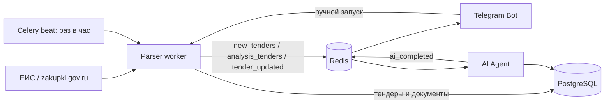

# Tender Bot — техническая документация

Сервис ищет закупки на ЕИС, сохраняет карточки и документацию, запускает ИИ-анализ и показывает результат в Telegram. Текущий фокус проекта — стабильность EIS-парсера и управляемый ручной запуск поиска.

## Архитектура



Компоненты развёрнуты через Docker Compose: PostgreSQL, Redis, parser worker, parser beat, AI Agent и Telegram bot. Общие файлы документации монтируются из `data/tenders` в parser и bot; бот получает том в режиме `read-only`.

## Потоки работы

1. `parser-beat` раз в час ставит `tasks.run_eis_parser` в Celery.
2. Администратор может запустить ту же задачу сразу в Telegram: командой `/search` или кнопкой «Запустить поиск».
3. Parser ищет ЕИС, получает карточку, скачивает доступные документы, сохраняет/обновляет данные в PostgreSQL.
4. Новый тендер публикуется сразу в `new_tenders` для первичного сообщения бота и отдельно в `analysis_tenders` для ИИ.
5. AI Agent записывает анализ в `tender_analysis` и публикует `ai_completed`; бот отправляет обновлённую карточку.
6. Изменение статуса закупки или дедлайна публикуется в `tender_updated`.

## EIS-поиск

`parser/platforms/eis_parser.py` работает через Playwright Chromium, строит фиксированную расширенную выдачу ЕИС по Липецкой области (`customerPlace=48000000000`) и меняет в ней только ключевое слово и номер страницы. В выдачу включены 44-ФЗ/223-ФЗ и активная подача заявок; дополнительно parser допускает только НМЦК от 5 000 руб. Браузер не использует внешний GeoIP-сервис при старте.

Поиск ОКПД2 отключён. Результаты дедуплицируются сначала по URL, затем по реестровому номеру в текущем запуске и в PostgreSQL.

Переменные parser-сервиса:

| Переменная | Назначение | Значение по умолчанию |
|---|---|---|
| `EIS_MAX_PAGES` | Число страниц на один поисковый запрос | `3` |
| `REDIS_URL` | Celery-брокер и шина событий | `redis://redis:6379/0` |

### Отладка без побочных эффектов

Кнопка «Тест поиска» ставит задачу `tasks.run_eis_parser(debug=True, max_pages=1)`. В этом режиме parser открывает только публичные страницы ЕИС и выводит найденные карточки в лог `parser`-контейнера. PostgreSQL, Redis-события, AI Agent и Telegram-уведомления не затрагиваются.

Просмотр вывода:

```powershell
docker compose logs -f parser
```

## Функциональность и статус реализации

| Функция | Статус | Комментарий |
|---|---|---|
| Поиск ЕИС по ключевым словам | 🟡 | Липецкая область, активная подача заявок, 44-ФЗ/223-ФЗ и НМЦК от 5 000 руб.; живой прогон отложен, пока VPN блокирует ЕИС. |
| Ручной запуск поиска из Telegram | ✅ | `/search` и кнопка доступны администратору, задача уходит в Celery worker. |
| Изолированный тест поиска | ✅ | Кнопка «Тест поиска»: один листинг, вывод в логи, без БД/Redis/ИИ/уведомлений. |
| Извлечение карточки закупки | 🟡 | Реализованы селекторы и резервное чтение полей; реальные формы ЕИС нужно подтвердить тестом. |
| Скачивание документов и версионирование | 🟡 | HTML-ответы и страницы ЕИС отбрасываются по MIME, сигнатуре и расширению; каталог создаётся только после получения бинарного файла. |
| Очистка неактуальной документации | ✅ | По истёкшему дедлайну и при сверке статуса закупки удаляются файлы и `tender_documents`; карточка тендера и ИИ-анализ остаются. |
| Дедупликация по реестровому номеру | ✅ | `save_or_update_tender` обновляет существующую запись без создания дубля. |
| Первичное уведомление о новом тендере | ✅ | Отправляется до завершения ИИ-анализа. |
| Обновление после ИИ-анализа | ✅ | AI Agent публикует `ai_completed`, бот читает актуальную запись анализа. |
| Список тендеров и пагинация | ✅ | `/tenders`, карточное представление, переход по страницам, CSV-экспорт. |
| Карточка тендера и документы | ✅ | Карточка содержит данные ЕИС, ИИ-сводку, статус, ссылку на ЕИС и кнопки файлов. Файлы до 49 МБ отправляются в Telegram. |
| Пользовательские статусы | ✅ | Семь статусов из `tender_statuses` сохраняются в `user_tender_status`. |
| Повторный ИИ-анализ | ✅ | Кнопка ставит UUID тендера в `analysis_tenders`. |
| Напоминания о дедлайне | ✅ | Для статусов «Под сомнением» и «Целевой», за 3 и 1 день. |
| Дайджест и CSV | ✅ | `/digest`, плановый дайджест и выгрузка `/export`. |
| Извлечение PDF/XLSX | ⚪ | В ИИ-пайплайне полноценно поддержан только `.docx`. |

Легенда: ✅ реализовано; 🟡 реализовано, но требует проверки на внешней площадке; ⚪ не реализовано.

## Ограничения и ближайшая проверка

1. ЕИС меняет HTML и антибот-защиту: перед продуктивным запуском нужно выполнить «Тест поиска» и сверить логи с реальными карточками.
2. Автоматизированных интеграционных тестов с ЕИС нет: они не должны быть частью обычного CI из-за VPN, внешней сети и защиты площадки.
3. Отправка больших документов ограничена лимитом Telegram; сейчас бот сообщает о файле свыше 49 МБ, но не формирует внешнюю ссылку на него.
4. Если `docker compose exec -T parser` получает от ЕИС `SSL EOF` или `ERR_CONNECTION_CLOSED`, нужно проверить сетевой прокси/VPN Docker Desktop: это обрыв TLS до получения HTTP-ответа ЕИС, а не ошибка селекторов парсера.
