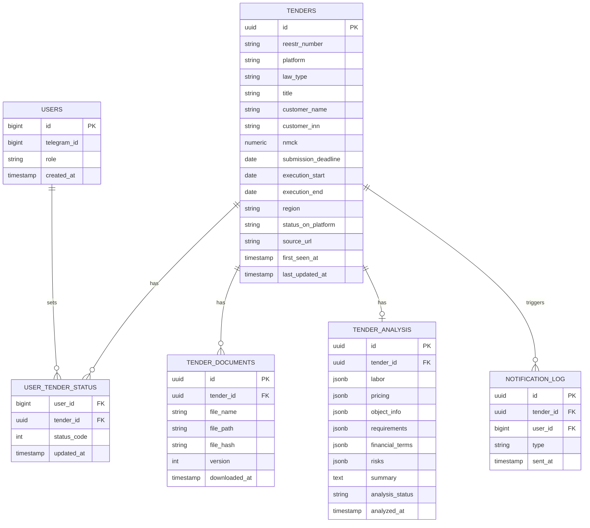

# Техническое задание

## Сервис автоматического поиска, анализа и мониторинга тендеров (охрана и пожарная безопасность)

Версия документа: 1.0
Дата: 13.07.2026

---

## 1. Общие сведения

### 1.1 Назначение системы

Система предназначена для автоматического поиска тендеров по направлениям **охрана (пультовая и физическая)** и **монтаж/обслуживание систем пожарной охраны** на электронных торговых площадках (в первую очередь ЕИС, 44-ФЗ и 223-ФЗ), автоматического анализа закупочной документации с помощью ИИ и предоставления пользователю удобного интерфейса (Telegram-бот) для просмотра, оценки и отслеживания тендеров.

### 1.2 Цели проекта

- Исключить ручной мониторинг тендерных площадок.
- Сократить время на первичный разбор документации (десятки страниц техзадания на тендер) до пары минут за счёт ИИ-анализа.
- Централизованно хранить историю по всем тендерам и статусам работы с ними (сквозная аналитика: сколько взяли, сколько выиграли, сколько проиграли).
- Обеспечить работу системы в режиме 24/7 на локальном оборудовании (домашний ПК/сервер) с возможностью безболезненного переноса на VPS в будущем.

### 1.3 Ключевой принцип архитектуры

Система строится как набор независимых микросервисов, упакованных в Docker-контейнеры и оркестрируемых через `docker-compose`. Каждый сервис:

- имеет собственный жизненный цикл (может быть перезапущен/обновлён/масштабирован независимо от других);
- общается с остальными только через очередь сообщений и/или базу данных, но не напрямую по коду;
- может быть заменён или продублирован (например, второй парсер для другой площадки) без изменения остальных сервисов.

### 1.4 Термины и сокращения

| Термин | Значение |
|---|---|
| ЕИС | Единая информационная система в сфере закупок (zakupki.gov.ru) |
| 44-ФЗ | Федеральный закон о контрактной системе (госзаказчики) |
| 223-ФЗ | Федеральный закон о закупках отдельных видов юрлиц (госкомпании, монополии) |
| НМЦК | Начальная (максимальная) цена контракта |
| ЭТП | Электронная торговая площадка |
| ОКПД2 | Общероссийский классификатор продукции по видам экономической деятельности |
| СМЗ | Служба мониторинга затрат (внутреннее — очередь задач) |
| LLM | Large Language Model, языковая модель (ИИ-агент анализа документов) |

---

## 2. Важный нюанс по источникам данных ЕИС (влияет на архитектуру парсера)

Перед проектированием парсера стоит зафиксировать несколько фактов о текущем состоянии ЕИС, которые напрямую влияют на выбор технологии:

1. **Официальная бесплатная FTP-выгрузка открытых данных ЕИС закрыта с 1 января 2025 года.** Раньше можно было забирать XML-выгрузки напрямую по FTP — сейчас вместо этого действует веб-сервис с более сложной схемой подключения (фактически, доступ ограничен и требует отдельной интеграции, местами платной через посредников).
2. Существуют коммерческие API-агрегаторы закупок (например, DaMIA, ofdata, «Мультитендер» и аналогичные), которые продают доступ к структурированным данным по 44-ФЗ/223-ФЗ. Это может быть **резервным** источником данных или способом валидации того, что нашёл парсер, но как основной источник для MVP закладывать платный API не будем — начинаем с браузерного парсинга публичного интерфейса ЕИС, как и задумано изначально.
3. Из этого следует практический вывод: **парсинг через headless-браузер (camoufox/Playwright) — оправданный и по сути единственный бесплатный вариант получения актуальных данных** с полным набором вложений документации. Официального свободного API с документами для конкретной закупки сейчас нет.
4. Это же означает, что нужно закладывать в архитектуру устойчивость к изменению вёрстки сайта ЕИС (парсер должен «падать по-хорошему»: логировать ошибку, присылать алерт, не блокировать весь пайплайн) — см. раздел 3.8.

---

## 3. Микросервис 1 — Parser Service

### 3.1 Назначение

Периодический обход тендерных площадок, отбор релевантных закупок по заданным критериям, извлечение карточки тендера и скачивание всей приложенной документации.

### 3.2 Технологический стек

- **Camoufox** — форк Firefox с защитой от антибот-детекта (подмена fingerprint, TLS/canvas и т.д.) — используется там, где сайт активно борется с автоматизацией.
- **Playwright** — управление браузером, ожидания, работа с динамическим контентом (ЕИС активно использует JS-рендеринг таблиц результатов поиска).
- **Python 3.12+** как основной язык сервиса.
- Возможность резервного перехода на прямые HTTP-запросы к внутренним API страницы поиска ЕИС (там, где это работает стабильно), чтобы не гонять браузер там, где не обязательно — это существенно снижает нагрузку и риск бана по IP.

### 3.3 Источники данных (Source Adapters)

Чтобы соответствовать требованию «масштабировать на несколько площадок», парсер проектируется по принципу **адаптеров источников**: у каждой площадки — свой модуль-адаптер с единым интерфейсом (`search()`, `get_card()`, `download_docs()`), который отдаёт данные в единый нормализованный формат. Это позволяет добавлять новые площадки, не трогая остальной код.

Источники на старте:

| Источник | ФЗ | Приоритет |
|---|---|---|
| zakupki.gov.ru (ЕИС) — раздел 44-ФЗ | 44-ФЗ | Высокий (MVP) |
| zakupki.gov.ru (ЕИС) — раздел 223-ФЗ | 223-ФЗ | Высокий (MVP) |
| Специализированные ЭТП (Сбербанк-АСТ, РТС-тендер, Росэлторг и др.) | 44-ФЗ/223-ФЗ | Средний (фаза 2) |
| Коммерческие агрегаторы (как резервный/сверочный источник) | — | Низкий (опционально) |

### 3.4 Критерии отбора тендеров

Фильтрация делается на двух уровнях, чтобы не пропустить релевантные закупки и не захлебнуться в мусоре:

1. **По кодам ОКПД2/ОКВЭД** (грубый, но надёжный фильтр):
   - услуги охраны (физическая охрана, пультовая охрана, услуги систем обеспечения безопасности);
   - услуги по монтажу и обслуживанию средств пожарной сигнализации, автоматических систем пожаротушения, электромонтажные работы, связанные с пожарной безопасностью.
2. **По ключевым словам в наименовании закупки** (дополнительный фильтр — на случай, если заказчик указал неточный код ОКПД2): «охрана объекта», «физическая охрана», «пультовая охрана», «тревожная кнопка», «пожарная сигнализация», «АПС», «СОУЭ», «техническое обслуживание пожарной автоматики» и т.п.
3. Фильтры хранятся не «зашитыми в код», а в виде конфигурации (таблица в БД или YAML-файл), чтобы можно было донастраивать список ключевых слов/кодов без деплоя нового кода.
4. Опционально — фильтр по региону (если пользователь работает не по всей России, а по конкретным субъектам).

### 3.5 Извлекаемые данные карточки тендера (сырые данные)

| Поле | Комментарий |
|---|---|
| Номер извещения/реестровый номер | Уникальный ключ, по нему дедупликация |
| Наименование закупки | — |
| Заказчик (наименование, ИНН) | — |
| Площадка | zakupki.gov.ru / другая ЭТП |
| Закон (44-ФЗ / 223-ФЗ) | — |
| Способ определения поставщика | Аукцион, конкурс, запрос котировок и т.д. |
| НМЦК | Начальная максимальная цена контракта |
| Дата и время окончания подачи заявок | Критично для приоритизации |
| Дата подведения итогов | — |
| Срок исполнения контракта | — |
| Регион поставки/оказания услуг | — |
| Размер обеспечения заявки/контракта | — |
| Ссылка на карточку тендера | — |
| Статус закупки на площадке | Подача заявок / определение поставщика / завершена |
| Список приложенных файлов документации | Название файла + прямая ссылка |

### 3.6 Работа с документацией

- Все файлы, приложенные к извещению, скачиваются и сохраняются в структуру:
  `/data/tenders/{platform}/{tender_number}/docs/{original_filename}`
- Рядом сохраняется `manifest.json` с метаданными: дата скачивания, хэш файла (для отслеживания, что заказчик обновил документацию), исходное имя.
- Если заказчик вносит изменения в закупку (новая версия документации), парсер должен это отследить и сохранить новую версию отдельно (`docs/v2/...`), не затирая старую — это важно, потому что версии ТЗ иногда различаются по факту, и предыдущая версия может понадобиться для истории/споров.
- Каталог `/data/tenders` монтируется как **общий Docker volume**, доступный и парсеру (запись), и ИИ-агенту (чтение).

### 3.7 Расписание работы

- Основной обход — по расписанию (например, каждые 15–30 минут для новых закупок; более редкий полный переобход раз в сутки для отслеживания изменений статусов уже найденных тендеров).
- Расписание реализуется через **Celery Beat** (либо APScheduler, если решаем не тянуть полный Celery-стек) — вынесенное в конфигурацию, а не хардкод.
- Дедупликация: перед сохранением каждой найденной закупки парсер проверяет её реестровый номер в БД; если тендер уже есть — обновляются только изменяемые поля (статус, дедлайн), а не создаётся дубликат.

### 3.8 Устойчивость и обход блокировок

- Camoufox снижает риск фингерпринт-детекта, но нужно закладывать и организационные меры:
  - разумные задержки между запросами (rate limiting), имитация человеческого поведения (случайные паузы, скроллинг);
  - ротация/использование прокси — опционально, как настраиваемая опция для будущего масштабирования (для одного ПК на старте может быть не нужна, но интерфейс конфигурации стоит заложить сразу);
  - обработка капчи — на старте закладываем ручное вмешательство (уведомление админу в Telegram, если капча блокирует парсинг) либо интеграцию с сервисом распознавания (2captcha и подобные) как опция фазы 2.
- Парсер обязан логировать структурированные ошибки и отправлять алерт (через тот же Telegram-бот или отдельный служебный чат), если:
  - верстка страницы изменилась и селекторы перестали находить элементы;
  - площадка недоступна N раз подряд;
  - обнаружена капча/блокировка по IP.
- Принцип: **лучше не найти тендер и сообщить об ошибке, чем молча закрыть баг и потерять данные незаметно.**

### 3.9 Взаимодействие с остальной системой

После сохранения новой/обновлённой карточки тендера и документации парсер:
1. Записывает сырые данные в PostgreSQL (таблица `tenders`).
2. Публикует событие `tender.found` (или `tender.updated`) в очередь сообщений с `tender_id`.
3. Дальше по цепочке это событие подхватывает ИИ-агент (для анализа документов) и — параллельно — Telegram-бот (для уведомления пользователя о новом тендере, ещё до готовности ИИ-анализа, чтобы не терять скорость реакции).

---

## 4. Микросервис 2 — AI Agent Service

### 4.1 Назначение

Извлечение из закупочной документации структурированных данных, которые вручную пришлось бы вычитывать часами: объём работ, стоимость часа, состав рисков, требования к персоналу и оборудованию.

### 4.2 Входные данные

- Все файлы из `/data/tenders/{tender_id}/docs/` — в основном PDF и DOCX, иногда XLSX (сметы) и сканы (реже, но нужно быть готовым к OCR).
- Приоритет обработки: техническое задание / проект контракта → смета/расчёт цены → прочие приложения.

### 4.3 Пайплайн обработки

1. **Извлечение текста**: PDF → текст (с fallback на OCR, если PDF — скан, а не текстовый слой), DOCX → текст, XLSX → таблицы в структурированном виде.
2. **Чанкинг** документа на смысловые части (по разделам ТЗ), если документ большой и не помещается в контекст модели за один проход.
3. **Извлечение структурированных данных через LLM** с фиксированной JSON-схемой на выходе (см. 4.5) — модель не «пишет отчёт», а заполняет строго заданные поля, что упрощает валидацию и хранение в БД.
4. **Валидация** ответа модели по JSON Schema; при несоответствии — повторный запрос с уточнением (retry с ограничением по числу попыток).
5. **Запись результата** в таблицу `tender_analysis`, связанную с `tender_id`.
6. **Событие** `analysis.completed` в очередь → бот присылает пользователю обновлённую карточку тендера с добавленным ИИ-анализом.

### 4.4 Извлекаемые аналитические данные

| Блок | Поля |
|---|---|
| Трудозатраты | Количество часов/смен, количество постов охраны, количество сотрудников по сменам, график работы (круглосуточно/по будням и т.д.) |
| Стоимость | Стоимость часа по начальной цене, общая НМЦК, наличие НМЦК по статьям (если расшифровка есть в смете) |
| Объект охраны/работ | Что охраняется (объект, площадь, количество точек/постов), какое оборудование используется или должно быть установлено (видеонаблюдение, СКУД, тревожная кнопка, тип пожарной сигнализации) |
| Требования к исполнителю | Необходимые лицензии (лицензия ЧОП, лицензия МЧС на пожарные работы), требования к персоналу (разряды, обучение, судимости и т.п., если указано), требования к опыту/аналогичным контрактам |
| Финансовые условия | Обеспечение заявки, обеспечение исполнения контракта, наличие/размер аванса, штрафные санкции и пени, порядок оплаты |
| Сроки | Дата начала и окончания исполнения, срок подачи заявок, срок рассмотрения заявок |
| Риски | Например: короткий срок исполнения, высокое обеспечение контракта относительно НМЦК, жёсткие штрафы, нетиповые требования к лицензиям, много неоднозначных формулировок в ТЗ, единственный участник в предыдущих аналогичных закупках заказчика (если есть данные) |
| Краткая сводка | 3–5 предложений человеческим языком: что за тендер, кому и зачем, есть ли что-то, на что стоит обратить внимание в первую очередь |

### 4.5 Формат вывода (пример JSON Schema, упрощённо)

```json
{
  "tender_id": "string",
  "labor": {
    "shifts_count": "number|null",
    "hours_total": "number|null",
    "posts_count": "number|null",
    "staff_per_shift": "number|null",
    "schedule": "string|null"
  },
  "pricing": {
    "hourly_rate_initial": "number|null",
    "total_price": "number|null",
    "advance_payment_percent": "number|null"
  },
  "object": {
    "description": "string",
    "equipment": ["string"],
    "fire_system_type": "string|null"
  },
  "requirements": {
    "licenses": ["string"],
    "staff_requirements": ["string"]
  },
  "financial_terms": {
    "bid_security": "number|null",
    "contract_security": "number|null",
    "penalties_summary": "string|null"
  },
  "deadlines": {
    "submission_deadline": "date",
    "execution_start": "date|null",
    "execution_end": "date|null"
  },
  "risks": [
    {"risk": "string", "severity": "low|medium|high"}
  ],
  "summary": "string"
}
```

### 4.6 Выбор модели и стоимость

- Для анализа документации рекомендуется модель с большим контекстным окном и хорошим качеством работы со структурированным выводом (например, через Anthropic API — Claude с включённым structured output/tool use для гарантии валидного JSON).
- Так как объём документации по одному тендеру может быть большим, стоит закладывать бюджет на токены и логировать стоимость анализа каждого тендера (таблица `analysis_cost_log`) — это даст понимание реальной unit-экономики сервиса при масштабировании на многих пользователей.
- Предусмотреть возможность ручного «пересчёта» анализа конкретного тендера из бота (кнопка «Проанализировать заново») — на случай, если заказчик обновил документацию или модель ошиблась.

### 4.7 Обработка ошибок

- Если документ не удалось распарсить (битый файл, нестандартный скан) — статус анализа помечается как `partial` или `failed`, конкретная причина логируется, пользователь в боте видит пометку «Не удалось проанализировать документацию — необходим ручной просмотр» вместо того, чтобы тендер тихо пропадал из вида.

---

## 5. Микросервис 3 — База данных (PostgreSQL)

### 5.1 Обоснование выбора

PostgreSQL выбран как СУБД, готовая к многопользовательскому режиму из коробки, с хорошей поддержкой JSONB (гибкие поля ИИ-анализа, которые могут расширяться со временем без миграции всей схемы) и полнотекстового поиска (поиск по наименованию/заказчику).

### 5.2 Основные таблицы (ER-модель, упрощённо)



### 5.3 Статусы тендера (STATUS_MAP)

Реализуется как справочная таблица `tender_statuses` (а не просто enum в коде), чтобы можно было добавлять новые статусы без пересборки сервисов:

| Код | Статус |
|---|---|
| 1 | 🔴 Проиграли |
| 2 | 🟢 Выиграли |
| 3 | 🟣 Не идём на тендер |
| 4 | 🟡 Под сомнением |
| 5 | 🔵 Подали заявку |
| 6 | ⚪ Не указан (дефолт) |
| 7 | 🔷 Целевой тендер |

Важный нюанс: статус хранится **в разрезе пользователя** (`user_tender_status`), а не как единое поле на тендере. Это сделано намеренно — при переходе от одного пользователя к команде из нескольких менеджеров разные люди должны иметь возможность независимо помечать один и тот же тендер (например, менеджер А считает его целевым, а руководитель — сомнительным). Если для вас это избыточно и статус всегда общий на всю компанию — это можно упростить обратно до одного поля на тендере, но задел на команду лучше заложить сразу, раз планируется многопользовательский Docker-деплой.

### 5.4 Индексация

- GIN-индекс по `to_tsvector` для полнотекстового поиска по `title` и `customer_name`.
- Обычные индексы по `reestr_number` (уникальный), `submission_deadline`, `region`, `law_type`.
- GIN-индекс по jsonb-полям `tender_analysis`, если планируется фильтрация/поиск по вложенным полям (например, «показать все тендеры с высоким риском»).

### 5.5 Резервное копирование

- Ежедневный `pg_dump` в volume, смонтированный на хостовую машину (не только внутрь контейнера — иначе бэкап пропадёт вместе с volume).
- Хранение бэкапов минимум за 14–30 дней с ротацией.
- Отдельный volume для `/data/tenders` (сама документация) — тоже нуждается в бэкапе, так как это первичные данные, которые не восстановить повторным парсингом (заказчик может убрать закупку с площадки).

---

## 6. Микросервис 4 — Telegram Bot (клиентский интерфейс)

### 6.1 Назначение

Основная точка входа пользователя в систему на первом этапе — до появления полноценного веб-интерфейса.

### 6.2 Функционал

1. **Список тендеров** — с пагинацией, карточным отображением (короткая сводка + инлайн-кнопки действий).
2. **Карточка тендера** — полная информация: сырые данные с площадки + результат ИИ-анализа + текущий статус + кнопка «открыть на площадке» + кнопка «скачать документы» (или ссылку на них, если файлы большие — отправлять сами файлы в Telegram, если размер позволяет).
3. **Простановка статуса** — инлайн-клавиатура с эмодзи из `STATUS_MAP`, обновление в один тап.
4. **Фильтрация и сортировка**:
   - по статусу (например, показать только «🟡 Под сомнением» или «🔷 Целевой тендер»);
   - по закону (44-ФЗ/223-ФЗ);
   - по сроку подачи заявки (ближайшие дедлайны — самое горячее наверх);
   - по региону;
   - по цене (НМЦК).
5. **Уведомления**:
   - о новом релевантном тендере (сразу после парсинга, не дожидаясь ИИ-анализа — скорость важнее полноты на этом шаге, анализ прилетит вторым сообщением/обновлением карточки);
   - о приближающемся дедлайне подачи заявки по тендерам в статусе «Под сомнением»/«Целевой» (например, за 3 дня и за 1 день — конфигурируемо);
   - об изменении статуса закупки на площадке (например, если заказчик отменил закупку или продлил срок).
6. **Ручной перезапуск анализа** конкретного тендера («Проанализировать заново»).
7. *(Предлагаю добавить)* **Дайджест** — по желанию, ежедневная или еженедельная сводка (сколько новых тендеров, сколько горящих дедлайнов), чтобы не пропустить важное, даже если не проверял бота каждый день.
8. *(Предлагаю добавить)* **Простой отчёт/экспорт** — выгрузка списка тендеров (например, в CSV/Excel) по текущим фильтрам, полезно для отчётности перед руководством/клиентом в будущем.

### 6.3 Права доступа (задел под многопользовательский режим)

- Роли: `admin` (доступ ко всем тендерам, настройкам фильтров парсера, статистике по стоимости ИИ-анализа) и `manager` (работа со списком тендеров и статусами).
- На старте, скорее всего, будет один пользователь — но таблица `users` и разграничение по `telegram_id` закладываются сразу, чтобы не переделывать бота при расширении команды.

### 6.4 Технологический стек

- **aiogram 3.x** (Python, асинхронный, хорошо документированная актуальная библиотека для Telegram-ботов).
- **Redis** как FSM-хранилище состояний диалога (тот же Redis, что уже используется как брокер очереди — не нужен отдельный инстанс).

---

## 7. Межсервисное взаимодействие

### 7.1 Почему нужна очередь сообщений, а не прямые вызовы

Изначально в задаче сервисы описаны как последовательный пайплайн (парсер → ИИ-агент → БД → бот). Прямые синхронные вызовы между сервисами (например, парсер напрямую дергает HTTP-эндпоинт ИИ-агента и ждёт ответа) создают жёсткую связанность: если ИИ-агент занят или упал, зависает и парсер. Поэтому предлагается:

- **Redis + Celery** как брокер задач и очередь событий — сервисы публикуют и подписываются на события (`tender.found`, `analysis.completed`, `deadline.approaching`), не дожидаясь друг друга синхронно.
- Каждый сервис может быть перезапущен, обновлён или временно недоступен без потери задач — задачи просто ждут в очереди.
- Это же даёт естественный путь к горизонтальному масштабированию: если нужно параллельно анализировать документы нескольких тендеров, просто поднимается несколько воркеров `AI Agent Service`, читающих из одной очереди.

### 7.2 Внутренний API (предлагаю добавить)

Отдельный лёгкий **FastAPI**-сервис (или встроенный в один из существующих сервисов эндпоинт) — единая точка доступа к данным БД для бота и, в будущем, для веб-сайта. Это позволяет:

- не дублировать SQL-запросы в боте и на будущем сайте;
- сразу иметь готовую основу для REST API, когда дело дойдёт до полноценного сайта, о котором вы упомянули как о следующем шаге.

Если на старте это кажется избыточным, можно временно обойтись прямыми запросами бота к БД — но тогда стоит хотя бы вынести весь SQL в отдельный модуль (data access layer), чтобы миграция на отдельный API-сервис в будущем была простой заменой реализации, а не переписыванием бота.

---

## 8. Дополнительные компоненты (предложено дополнительно)

| Компонент | Зачем |
|---|---|
| **Мониторинг/логирование** | Хотя бы структурированные логи (JSON) в файлы + healthcheck-эндпоинт у каждого сервиса. На старте необязательно поднимать полный Prometheus+Grafana — но лог, который можно прочитать при падении парсера в 3 часа ночи, обязателен. |
| **Управление секретами** | `.env`-файл вне репозитория (токен бота, ключ Anthropic API, пароль БД), подключаемый через `env_file` в docker-compose. Не хранить секреты в коде/образах. |
| **Хранилище документов** | На старте — обычный Docker volume на диске ПК. Если в будущем понадобится доступ с нескольких машин или из веб-интерфейса — рассмотреть MinIO (S3-совместимое хранилище) как замену файловой системе без изменения остального кода. |
| **Резервное копирование целиком** | Регулярный бэкап volume с БД и volume с документами на внешний диск/облако — иначе локальный ПК является единой точкой отказа для всех данных. |
| **CI/CD** | Не обязательно на старте (один разработчик, один ПК), но стоит держать `Dockerfile` и `docker-compose.yml` в git с самого начала, чтобы деплой был воспроизводим. |

---

## 9. Docker Compose — структура развёртывания (пример)

```yaml
version: "3.9"

services:
  postgres:
    image: postgres:16
    restart: unless-stopped
    environment:
      POSTGRES_DB: tenders
      POSTGRES_USER: ${DB_USER}
      POSTGRES_PASSWORD: ${DB_PASSWORD}
    volumes:
      - pgdata:/var/lib/postgresql/data
      - ./backups:/backups
    networks: [tender_net]

  redis:
    image: redis:7
    restart: unless-stopped
    networks: [tender_net]

  parser:
    build: ./parser
    restart: unless-stopped
    depends_on: [postgres, redis]
    env_file: .env
    volumes:
      - tender_docs:/data/tenders
    networks: [tender_net]

  ai_agent:
    build: ./ai_agent
    restart: unless-stopped
    depends_on: [postgres, redis]
    env_file: .env
    volumes:
      - tender_docs:/data/tenders
    networks: [tender_net]

  api:
    build: ./api
    restart: unless-stopped
    depends_on: [postgres]
    env_file: .env
    networks: [tender_net]

  telegram_bot:
    build: ./bot
    restart: unless-stopped
    depends_on: [postgres, redis, api]
    env_file: .env
    networks: [tender_net]

volumes:
  pgdata:
  tender_docs:

networks:
  tender_net:
```

Каждый сервис — отдельная папка с собственным `Dockerfile` и зависимостями, что соответствует требованию «разделить на микросервисы».

---

## 10. Нефункциональные требования

- **Отказоустойчивость**: падение одного сервиса не должно останавливать остальные (обеспечивается очередью и `restart: unless-stopped`).
- **Производительность**: полный цикл «нашли тендер → уведомили пользователя» — не более нескольких минут; ИИ-анализ документации — не более 5–10 минут на тендер (зависит от объёма документов).
- **Безопасность**: секреты не в коде; при многопользовательском режиме — разграничение доступа по `telegram_id`; регулярные бэкапы.
- **Расширяемость**: добавление новой площадки-источника не должно требовать изменений в ИИ-агенте, БД или боте (только новый адаптер в парсере).
- **Наблюдаемость**: любая ошибка в любом сервисе должна быть видна человеку (лог + при необходимости — алерт в Telegram), а не тихо теряться.

---

## 11. Риски проекта и способы митигации

| Риск | Митигация |
|---|---|
| Изменение вёрстки/логики ЕИС ломает парсер | Адаптер-паттерн, алерты при падении селекторов, регулярный ручной контроль первое время |
| Капча/блокировка по IP при частом опросе | Разумные интервалы, camoufox для антидетекта, опциональные прокси как задел на будущее |
| Стоимость LLM-анализа растёт с числом тендеров/пользователей | Логирование стоимости на тендер, кэширование анализа, ручной перезапуск только по требованию, а не «на всякий случай» |
| Единая точка отказа — один домашний ПК | Регулярные бэкапы БД и документов вне ПК; при росте — перенос на VPS без изменения архитектуры (Docker переносится как есть) |
| Ошибка ИИ-агента в критичном поле (например, в НМЦК) ведёт к неверному решению | ИИ-анализ дополняет, но не заменяет сырые данные с площадки — в карточке тендера всегда видно и то, и другое, плюс ссылка на первоисточник |

---

## 12. Этапы реализации (Roadmap)

**Этап 1 — MVP (минимально жизнеспособный продукт)**
- Парсер: только ЕИС, только 44-ФЗ, ключевые слова по охране.
- ИИ-агент: базовый набор полей (без полного риск-анализа).
- БД: минимальная схема (tenders, tender_analysis, user_tender_status).
- Бот: список, карточка, простановка статуса, уведомление о новом тендере.

**Этап 2 — Расширение охвата**
- Добавление 223-ФЗ и направления «пожарная охрана».
- Полный риск-анализ и финансовые условия в ИИ-агенте.
- Уведомления о дедлайнах, ручной перезапуск анализа.
- Резервное копирование, healthcheck, базовое логирование.

**Этап 3 — Масштабирование источников и пользователей**
- Адаптеры для дополнительных ЭТП.
- Многопользовательский режим, роли.
- Внутренний API (FastAPI) как основа для будущего сайта.

**Этап 4 — Веб-интерфейс**
- Полноценный сайт поверх готового API, Telegram-бот остаётся как канал уведомлений.

---

## 13. Возможности дальнейшего развития (вне рамок MVP, но стоит держать в уме)

- Аналитика по заказчикам: сколько раз заказчик проводил похожие закупки, кто обычно выигрывает (если данные о результатах закупок доступны) — помогает оценивать реальные шансы ещё до подачи заявки.
- Автоматическая проверка заказчика/потенциальных конкурентов на признаки недобросовестности (реестр РНП) через открытые реестры ФАС.
- Экспорт коммерческого предложения/расчёта стоимости на основе данных ИИ-анализа (полуавтоматическая подготовка заявки).
